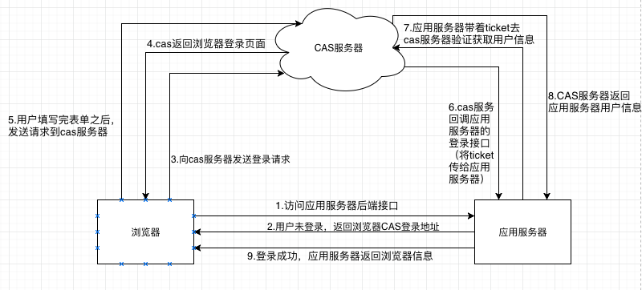

## CAS说明
[返回目录](../index.md)

### 定义
CAS Central Authentication Service的缩写，中央认证服务

### CAS登录过程
  
> 注意：图中的应用服务就是CAS Client；CAS服务器是CAS Server  

从结构上看，CAS包括两部分：CAS Server和CAS Client。CAS Server需要独立部署，主要负责对用户的认证工作，
CAS Client负责处理对客户端受保护资源的访问请求，需要登录时，重定向到CAS Server。  
CAS Client与受保护的客户端应用部署在一起，以Filter方式保护受保护的资源。对于访问受保护的每个web请求，
CAS Client会分析请求的HTTP请求是否含有Service Ticket，如果没有，则说明当前用户未登录，于是将请求重定向
到指定好的CAS登录地址，并传递Service(也就是要访问的目的地址)，以便登录成功之后跳转回业务系统，用户在第
5步输入认证信息，如果登录成功，CAS Server就会生成一个相当长度、唯一、不可伪造的Service Ticket，并缓存
以待后续验证，之后系统自动重定向到Service地址，并为客户端设置一个Ticket Grant Cookie(TGC)，CAS Client
在拿到Service和新产生的Ticket之后，在第6、7步的时候向CAS Server核实身份，以确保Service Ticket准确性
