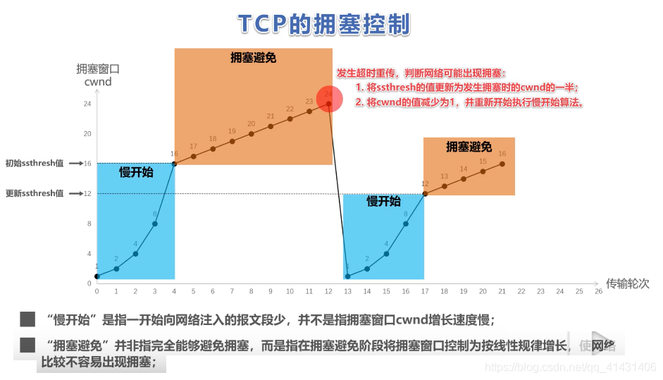
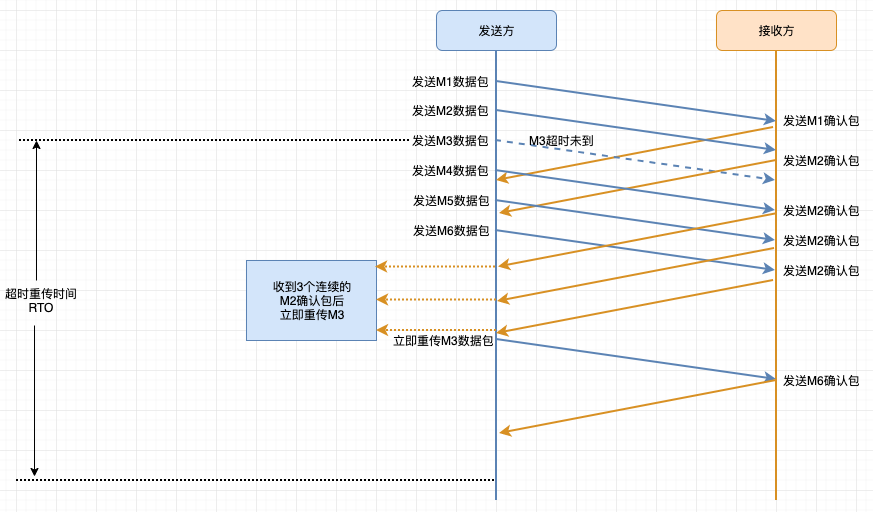
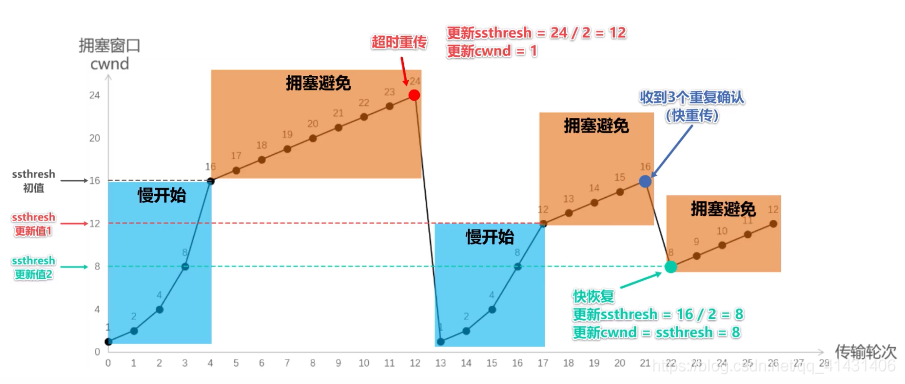

## TCP可靠性是如何保证的
[返回首页](../index.md)
### 校验和
通过「校验和」来判断传输的内容是否有变动。  
计算方式： 发送方将整个报文分为多个16位的段，然后将所有段进行反码相加，将结果放到「校验和」字段中，接收方使用相同的方法进行计算，
如最终结果为检验字段所有位都为1则正确（UDP所有位都为0）  

### 序列号  
TCP为每个字节都编号了，这就是「序列号」。  
作用：
- 保证数据可靠性（少了哪个序列号，能够立马就知道）  
- 保证数据按顺序到达。  
- 提高效率，可以多次发送，一次确认。
- 去除重复数据。  

### 确认应答机制「ACK」 
在TCP首部中有一个标志位「ACK」，此标志位标识确认号是否有效，接收方会对于按序到达的数据进行确认，当「ACK」= 1时确认字段有效，表
示这个字段已经按序到达。而且如果发送方接收到了已发送报文的确认报文，则继续传输下一部分数据，如果等待了一段时间还没有收到确认报文
就会启动超时重传策略。

### 超时重传机制  
当报文发出去之后在一定时间内没有收到确认包，发送方就会重新发送。  
超时重传有两种情况：  
1. 发送方数据包丢失。超时之后发送方重新发送数据包即可。
2. 「ACK」数据包丢失。超时会后发送方重新发送数据包，接收方会根据序列号来判断，如果已经接受到了该数据包，则丢弃返回「ACK」确认包。  
  
**等待时间的确定：**   
报文段发出到收到应答报文的过程是一个RTT时间，超时重传时间RTO略大约RTT，TCP会根据网络情况动态计算RTT时间，所以RTO时间也是不断变
化的

### 连接管理机制 
「连接管理」就是TCP的三次握手和四次挥手。  

### 流量控制
接收端处理数据的速度是有限的。如果发送方发送数据太快，会导致接收端的缓冲区满，而发送方继续发送，就会造成丢包，继而引起丢包重传等
一系列问题。  

因此TCP支持根据接收端的接受能力来决定发送端的发送速度。这个机制就叫-「流量控制」。  
在TCP报文首部有一个16位窗口长度字段，用来表明接收到缓冲区可接受的数据量大小。当接收端收到发送端发送的数据后，在返回的「ACK」包中
将自身缓冲区剩余大小放入到这个16位窗口长度字段中，这个字段的大小随传输情况而变，窗口越大，网络吞吐量约高，而一旦接收方缓冲区快满
了，就将窗口值调小通知发送方，如果缓冲区满了，就将窗口调节为0，发送方收到之后就不在发送数据包了。但需要定期发送一个窗口数据段，
使接收端把自身的窗口情况告知发送方。  

### 拥塞控制  
在某短时间内，对网络中某一资源的需求超过了该资源所能提供的可用部分，网络性能就会变差，这种情况就要「网络拥塞」。  
在计算机网络中带宽、交换节点中的缓存、处理机等，都是网络资源。  
若出现网络拥塞而不控制，整个网络的吞吐量会随着输入的负荷增大而下降。  

> TCP拥塞控制的4中算法：「慢启动」 「拥塞避免」 「快重传」 「快恢复」

- 发送方维护一个叫做「拥塞窗口」cwnd的变量，其值取决于网络的拥塞程度，并且动态变化  
    - 拥塞窗口的维护原则：只要网络没有出现拥塞，拥塞窗口就在增大一些，但只要网络出现拥塞，拥塞窗口就调小一些。
    - 判断出现网络拥塞的原则：没有按时收到应当到达的确认报文（即发生重传）
- 发送方将拥塞窗口作为发送窗口时：swnd = cwnd 
- 维护一个慢启动阈值「ssthresh」状态变量：  
    - 当cwnd < ssthresh时，使用慢启动算法。
    - 当cwnd > ssthresh时，停止使用慢启动算法，改用拥塞避免算法。
    - 当cwnd = ssthresh时，即可以使用慢启动算法，也可以使用拥塞避免算法。  
    

#### 拥塞窗口
发送开始时定义的拥塞窗口为1，每次收到ACK应答之后，拥塞窗口就会增加1，而在每次发送数据时，发送窗口取拥塞窗口与接收端接收窗口最小值。  

#### 慢启动 
流量控制解决了两台主机之间因传输速率而可能引起的丢包问题，在一定程度上保证了TCP数据传输的可靠性。然而如果网络拥堵，此时在发送数
据包就会加重网络负担，并且发送的数据包很可能就会超过最大生存时间也没有到达接收方，这样就会产生丢包问题。  
为此TCP引入了「慢启动」机制，先发出少量数据，就像探路一样，先摸清楚当前网络的拥塞状态后，再决定按照多大的速率传输数据。  

在启动初期以指数的方式增长，设置一个慢启动的阈值，当以指数增长到阈值之后就会停止指数增长，按照线性增长方式增加，线性增长到网络拥
塞时理解"乘法减小"，拥塞窗口置为1，进行新一轮的慢启动，同时新一轮的阈值设置为原来的一半。  

#### 拥塞避免
每个传输轮次，拥塞窗口cwnd只能线性加1，而不是像慢启动算法，每个传输轮次拥塞窗口cwnd植树增长。  

**慢启动和拥塞避免示意图：**  

#### 快重传 
1. 发送方发送M1数据报文段，接收方收到M1报文段后给发送方返回M1报文的确认包。
2. 在M1报文段确认包到达发送方之前，发送方还可以将发送窗口内的M2数据报文段发送出去，接收方收到M2报文段之后，给发送方返回M2报文段
的确认包。
3. 在M2数据包未到接收方之前，发送方就已经将发送窗口内的M3数据报文段发送出去。若网络出现延迟，M3数据包一直未到接收方。
4. 但是方发送在没有收到M3确认包的前提下，继续发送发送窗口内的M4、M5、M6数据包，但是接收方一直没有收到M3数据包。就会在接收到M4、
M5、M6数据包之后，回传给发送方M2确认包。并且接收方会将M4、M5、M6放入缓冲区中。
5. 发送方在接收到3次M2确认包之后，就会知道M3数据包没有发送到接收方，于是就会重传M3数据包，接收方接收到M3数据包之后，就会回传给
发送方M6的确认包，表明M1-M6数据到都已经收到了，这样就不会造成发送方对M3数据的超时重传，而是提早收到了重传。

快重传示意图：  

> 所谓「快重传」，就是是发送方尽快进行重传，而不是等到超时后在重传：  
> - 要求接收方不要等待自己发送数据时才进行重传，而是要**立即发送确认**。  
> - 即使受到了失序的报文段也要立即发送对于已收到的报文段的**重复确认**。  
> - 发送方一旦**接到3个连续的重复确认**，就将响应的报文段立即重传，而不是等该报文段超时之后在重传。  
> - 对于个别丢失的报文段，发送方不会出现超时重传，也就不会误认为出现了拥塞（进而降低了拥塞窗口cwnd减少为1），使用快重传可以是
    整个网络的吞吐量提高约20%。 
    
#### 快恢复  
发送方一旦受到3次重复确认，就知道现在只是丢失了个别的报文段，于是不启用慢启动算法，而是执行「快恢复」算法：  
1. 发送方将慢启动阈值ssthresh值和拥塞窗口cwnd值调整为当前窗口的一般，开始执行拥塞避免算法。
2. 也有的快恢复是把快恢复开始时的拥塞窗口cwnd值在增大一些，即等于ssthresh+3，原因如下：  
    * 既然发送方收到了3个连续的重复确认，就表明有3个数据报文段已经发送到了接收方。
    * 这三个报文段不在消耗网络资源，而是停留在了接收方的接收缓冲区中。
    * 可见现在网络中不是堆积了报文段，而是减少了3个报文段，因此可以适当的把拥塞串口扩大一些。

    