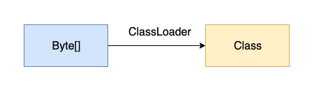
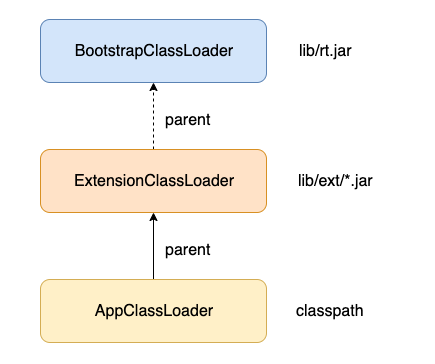
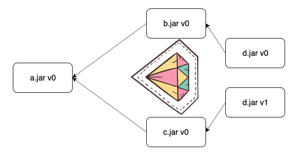

## ClassLoader原理
[返回首页](../index.md)

### ClassLoader定义
它是用来加载Class的，负责将Class的字节码形式转换成内存形式的Class对象。  
字节码可以来自于磁盘文件的*.class，也可以是jar包里的*.class，也可以来自于远程服务器提供的字节流。  


### 延迟加载
JVM运行并不是一次性把所有类都加载进内存的，它是按需加载的，也就是延迟加载。  
程序在运行过程中会遇到很多未加载的类，这时候就会调用ClassLoader来加载这些类了，加载完成之后就会Class对象存到ClassLoader中。  

### ClassLoader类型及职责
JVM中内置了3个重要的ClassLoader，分别是：BootstrapClassLoader、ExtensionClassLoader和AppClassLoader.  
- BootstrapClassLoader负责加载JVM运行时核心类。这些类位于JAVA_HOME/lib/rt.jar文件中，比如我们常用的内置库java.*，它是由C代码
写成的，我们称之为【根加载器】。    
```
file:/Library/Java/JavaVirtualMachines/jdk1.8.0_231.jdk/Contents/Home/jre/lib/resources.jar
file:/Library/Java/JavaVirtualMachines/jdk1.8.0_231.jdk/Contents/Home/jre/lib/rt.jar
file:/Library/Java/JavaVirtualMachines/jdk1.8.0_231.jdk/Contents/Home/jre/lib/sunrsasign.jar
file:/Library/Java/JavaVirtualMachines/jdk1.8.0_231.jdk/Contents/Home/jre/lib/jsse.jar
file:/Library/Java/JavaVirtualMachines/jdk1.8.0_231.jdk/Contents/Home/jre/lib/jce.jar
file:/Library/Java/JavaVirtualMachines/jdk1.8.0_231.jdk/Contents/Home/jre/lib/charsets.jar
file:/Library/Java/JavaVirtualMachines/jdk1.8.0_231.jdk/Contents/Home/jre/lib/jfr.jar
```
- ExtensionClassLoader负责加载JVM扩展类，比如swing系列、内置的js引擎、xml解析引擎等，这些类通常以javax.*开头，jar包位于
JAVA_HOME/lib/ext/*.jar中  
- AppClassLoader是直接面向用户的类加载器，他会加载Classpath环境变量里定义的jar包和目录，我们自己编写的代码或者第三方的jar包
也是通过它来加载的。  

- 针对网络上提供的jar文件或者class文件，jdk内置了一个URLClassLoader，它不仅可以加载网络上的类库，还可以加载本地路径的类库，
ExtensionClassLoader和AppClassLoader都是它的子类。  

### 全盘负责委托机制
java装载类使用【全盘负责委托机制】。  
【全盘负责】是指当一个`ClassLoader`装载一个类时，除非显示的使用另一个`ClassLoader`，该类所依赖及引用的类也是由这个ClassLoader
引入的。  
【委托机制】是指装载一个类的时候，先委托父类去寻找目标类，如果父类没有找到才从自己的类装载器中加载该类。  
> 双亲委派模型：AppClassLoader必须将系统类库的装载工作交由ExtensionClassLoader和BootstrapClassLoader来做。  


> ExtensionClassLoader的parent指针画的是虚线，因为它的parent是null，当parent是null时，就表明它的父加载器是「根加载器」。  

### Class.forName
我们使用jdbc时，经常使用Class.forName来动态加载驱动类：  
```
Class.forName("com.mysql.cj.jdbc.Driver");
``` 
其原理是mysql驱动的Driver类里有一个静态代码块，他会在Driver类被加载的时候执行，这个静态代码块会将mysql驱动实例注册到全局的jdbc
驱动管理器中。  
```$xslt
static {
    try {
        DriverManager.registerDriver(new Driver());
    } catch (SQLException var1) {
        throw new RuntimeException("Can't register driver!");
    }
}
``` 

### 钻石依赖
> 项目管理里面有一个著名的概念「钻石依赖」，是指软件依赖导致同一个软件包的两个版本需要共存而不能冲突。



我们平时使用的maven是这样解决钻石依赖的，他会从多个冲突版本中选择一个版本来使用，如果不同版本之间兼容性很差，那么程序将无法正常
编译运行，maven的这种形式叫「扁平化」管理。  

使用ClassLoader可以解决钻石依赖问题，不同版本的软件包使用不同的ClassLoader来加载，**位于不同的ClassLoader中名字一样的类实际上
是不同的类**。ClassLoader固然能够解决依赖冲突问题，不过也限制了不同软件包的操作界面必须使用反射或者接口的方式进行动态调用。
Maven没有这种限制，它依赖于虚拟机默认的懒惰加载策略，运行过程中如果没有显示特定的ClassLoader，那么从头到尾都是使用
AppClassLoader,而不同的版本同名类必须使用不同的ClassLoader加载，所以Maven不能完美解决钻石依赖问题。
