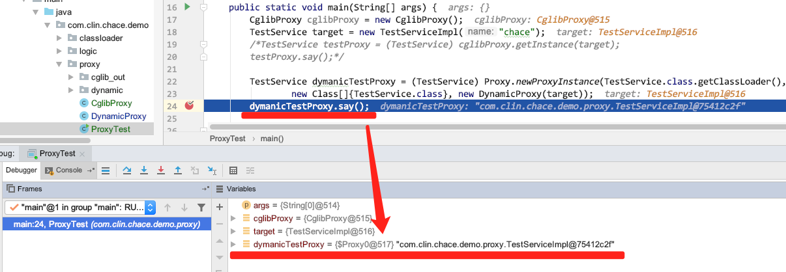

## 动态代理
[返回首页](../index.md)

### JDK动态代理类
```$xslt
public class DynamicProxy implements InvocationHandler {

    private Object delegate;

    public DynamicProxy(Object delegate) {
        this.delegate = delegate;
    }

    @Override
    public Object invoke(Object proxy, Method method, Object[] args) throws Throwable {
        System.out.println("In proxy");
        Object result = method.invoke(delegate, args);
        System.out.println("Exit proxy");
        return result;
    }

    public Object getProxy(ClassLoader cl, Class clazz) {
        return Proxy.newProxyInstance(cl, new Class[]{clazz}, this);
    }
}
```

### JDK动态代理类原理
首先看一下动态代理生成的类是什么，通过debug查看一下生成的类名：  
  


我们发现创建的类名是`$Proxy0@517`，首先我们先看一下如何生成这个类的。  
通过代码 `Proxy.newProxyInstance(cl, new Class[]{clazz}, this);` 生成这个类的，那么`newProxyInstance`里面做了什么呢? 

```$xslt
@CallerSensitive
public static Object newProxyInstance(ClassLoader loader,
                                      Class<?>[] interfaces,
                                      InvocationHandler h) throws IllegalArgumentException {
                                      
    // 判断传入的InvocationHandler是否为null
    Objects.requireNonNull(h);

    final Class<?>[] intfs = interfaces.clone();
    
    // 检查是否有权限
    final SecurityManager sm = System.getSecurityManager();
    if (sm != null) {
        checkProxyAccess(Reflection.getCallerClass(), loader, intfs);
    }

    // 生成代理类
    Class<?> cl = getProxyClass0(loader, intfs);

    // 使用指定的InvocationHandler代理程序调用被代理类的构造函数
    try {
        if (sm != null) {
            checkNewProxyPermission(Reflection.getCallerClass(), cl);
        }

        final Constructor<?> cons = cl.getConstructor(constructorParams);
        final InvocationHandler ih = h;
        if (!Modifier.isPublic(cl.getModifiers())) {
            AccessController.doPrivileged(new PrivilegedAction<Void>() {
                public Void run() {
                    cons.setAccessible(true);
                    return null;
                }
            });
        }
        
        // 通过 「反射」创建对象(被代理的类)，
        return cons.newInstance(new Object[]{h});
    } catch (IllegalAccessException|InstantiationException e) {
        throw new InternalError(e.toString(), e);
    } catch (InvocationTargetException e) {
        Throwable t = e.getCause();
        if (t instanceof RuntimeException) {
            throw (RuntimeException) t;
        } else {
            throw new InternalError(t.toString(), t);
        }
    } catch (NoSuchMethodException e) {
        throw new InternalError(e.toString(), e);
    }
}
```
生成代理类的关键在 `Class<?> cl = getProxyClass0(loader, intfs);`，我们看一下 `getProxyClass0` 做了哪些事情.  
```
private static Class<?> getProxyClass0(ClassLoader loader, Class<?>... interfaces) {
    if (interfaces.length > 65535) {
        throw new IllegalArgumentException("interface limit exceeded");
    }

    // 先从代理类缓存中查找是否已经生成了该代理类
    // 如果没有找到，则通过ProxyClassFactory创建一个新的代理类
    return proxyClassCache.get(loader, interfaces);
}
```
继续查看 `proxyClassCache.get(loader, interfaces);`：  
```
public V get(K key, P parameter) {
    Objects.requireNonNull(parameter);

    expungeStaleEntries();

    Object cacheKey = CacheKey.valueOf(key, refQueue);

    // 如果从cache中没有获取到，则创建一个空的CuncurrentHashMap 【懒加载】
    ConcurrentMap<Object, Supplier<V>> valuesMap = map.get(cacheKey);
    if (valuesMap == null) {
        ConcurrentMap<Object, Supplier<V>> oldValuesMap
            = map.putIfAbsent(cacheKey,
                              valuesMap = new ConcurrentHashMap<>());
        if (oldValuesMap != null) {
            valuesMap = oldValuesMap;
        }
    }

    // 通过subKeyFactory创建一个subKey
    Object subKey = Objects.requireNonNull(subKeyFactory.apply(key, parameter));
    Supplier<V> supplier = valuesMap.get(subKey);
    Factory factory = null;

    while (true) {
        if (supplier != null) {
            // supplier might be a Factory or a CacheValue<V> instance
            V value = supplier.get();
            if (value != null) {
                return value;
            }
        }
        // else no supplier in cache
        // or a supplier that returned null (could be a cleared CacheValue
        // or a Factory that wasn't successful in installing the CacheValue)

        // 延迟创建Factory
        if (factory == null) {
            factory = new Factory(key, parameter, subKey, valuesMap);
        }

        if (supplier == null) {
            supplier = valuesMap.putIfAbsent(subKey, factory);
            if (supplier == null) {
                // successfully installed Factory
                supplier = factory;
            }
            // else retry with winning supplier
        } else {
            if (valuesMap.replace(subKey, supplier, factory)) {
                // successfully replaced
                // cleared CacheEntry / unsuccessful Factory
                // with our Factory
                supplier = factory;
            } else {
                // retry with current supplier
                supplier = valuesMap.get(subKey);
            }
        }
    }
}
```
继续查看 `subKeyFactory.apply(key, parameter)`， **这个就是最终创建类的关键代码**:  
> 通过 「反射」 创建代理类
``` 
public Class<?> apply(ClassLoader loader, Class<?>[] interfaces) {
    
    Map<Class<?>, Boolean> interfaceSet = new IdentityHashMap<>(interfaces.length);
    for (Class<?> intf : interfaces) {
        /*
         * Verify that the class loader resolves the name of this
         * interface to the same Class object.
         */
        Class<?> interfaceClass = null;
        try {
            interfaceClass = Class.forName(intf.getName(), false, loader);
        } catch (ClassNotFoundException e) {
        }
        if (interfaceClass != intf) {
            throw new IllegalArgumentException(
                intf + " is not visible from class loader");
        }
        /*
         * Verify that the Class object actually represents an
         * interface.
         */
        if (!interfaceClass.isInterface()) {
            throw new IllegalArgumentException(
                interfaceClass.getName() + " is not an interface");
        }
        /*
         * Verify that this interface is not a duplicate.
         */
        if (interfaceSet.put(interfaceClass, Boolean.TRUE) != null) {
            throw new IllegalArgumentException(
                "repeated interface: " + interfaceClass.getName());
        }
    }
    
    String proxyPkg = null;     // package to define proxy class in
    int accessFlags = Modifier.PUBLIC | Modifier.FINAL;
    
    /*
     * Record the package of a non-public proxy interface so that the
     * proxy class will be defined in the same package.  Verify that
     * all non-public proxy interfaces are in the same package.
     */
    for (Class<?> intf : interfaces) {
        int flags = intf.getModifiers();
        if (!Modifier.isPublic(flags)) {
            accessFlags = Modifier.FINAL;
            String name = intf.getName();
            int n = name.lastIndexOf('.');
            String pkg = ((n == -1) ? "" : name.substring(0, n + 1));
            if (proxyPkg == null) {
                proxyPkg = pkg;
            } else if (!pkg.equals(proxyPkg)) {
                throw new IllegalArgumentException(
                    "non-public interfaces from different packages");
            }
        }
    }
    
    if (proxyPkg == null) {
        // if no non-public proxy interfaces, use com.sun.proxy package
        proxyPkg = ReflectUtil.PROXY_PACKAGE + ".";
    }
    
    /*
     * Choose a name for the proxy class to generate.
     */
    long num = nextUniqueNumber.getAndIncrement();
    String proxyName = proxyPkg + proxyClassNamePrefix + num;
    
    /*
     * Generate the specified proxy class.
     */
    byte[] proxyClassFile = ProxyGenerator.generateProxyClass(
        proxyName, interfaces, accessFlags);
    try {
        return defineClass0(loader, proxyName,
                            proxyClassFile, 0, proxyClassFile.length);
    } catch (ClassFormatError e) {
        /*
         * A ClassFormatError here means that (barring bugs in the
         * proxy class generation code) there was some other
         * invalid aspect of the arguments supplied to the proxy
         * class creation (such as virtual machine limitations
         * exceeded).
         */
        throw new IllegalArgumentException(e.toString());
    }
}
```
至此，通过以上代码我们发现，JDK动态代理是通过「反射」创建的代理类，关键在于这句:  
> interfaceClass = Class.forName(intf.getName(), false, loader);   
这个使用了「类加载」的东西，详细的请看 [ClassLoader原理](./ClassLoader原理.md)

也是通过「反射」创建的被代理类，关键在于这句：  
> cons.newInstance(new Object[]{h});  
内部使用了 「Constructor.newInstance()」方法，详情请看 ***

### CGLib动态代理
> JDK动态代理使用起来很方便，但是需要被代理类有一个接口，当被代理类没有接口的情况下，可以使用「CGLib」.     

**CGLib动态代理底层使用的是ASM的字节码技术**。  
CGLib的Demo:  
```
public class CglibProxy implements MethodInterceptor {

    private Object target;

    public CglibProxy() {

    }

    public Object getInstance(Object target) {
        this.target = target;
        Enhancer enhancer = new Enhancer();
        enhancer.setSuperclass(this.target.getClass());
        enhancer.setCallback(this);
        return enhancer.create();
    }

    @Override
    public Object intercept(Object o, Method method, Object[] objects, MethodProxy methodProxy) throws Throwable {
        System.out.println("in cglib proxy");
        Object result = method.invoke(target, objects);
        System.out.println("exit cglib proxy");
        return result;
    }
}
```

### 常用动态代理框架
#### SpringAop
SpringAop使用了JDK动态代理和CGLib动态代理。  

#### Mybatis动态代理  
MyBatis使用的是Mapper接口+XML的开发模式，在开发的时候，我们只需要创建DAO的接口类与对应的XML sql即可，MyBatis其实就是使用
JDK动态代理生成Mapper接口的实现类，从而根据XML的定义完成DAO操作。  


